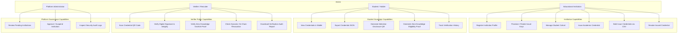

# USE_CASE_DIAGRAMS.md — System Use Case Models

> **Document ID**: DIAG-002  
> **Status**: Confirmed Technical Specification

---

## 1. Primary Actors & Use Case Interactions

```mermaid
flowchart TD
    subgraph Actors
        Inst[Educational Institution]
        Stud[Student / Holder]
        Verif[Verifier / Recruiter]
        Admin[Platform Administrator]
    end

    subgraph Institution_UseCases ["Institution Capabilities"]
        UC1[Register Institution Profile]
        UC2[Provision / Rotate Issuer Keys]
        UC3[Manage Student Cohort]
        UC4[Issue Academic Credential]
        UC5[Bulk Issue Credentials via CSV]
        UC6[Revoke Issued Credential]
    end

    subgraph Student_UseCases ["Student Sovereign Capabilities"]
        UC7[View Credentials in Wallet]
        UC8[Export Credential JSON]
        UC9[Generate Selective Disclosure QR]
        UC10[Generate Zero-Knowledge Eligibility Proof]
        UC11[Track Verification History]
    end

    subgraph Verifier_UseCases ["Verifier Public Capabilities"]
        UC12[Scan Credential QR Code]
        UC13[Verify Digital Signature & Integrity]
        UC14[Verify Zero-Knowledge Groth16 Proof]
        UC15[Check Dynamic On-Chain Revocation]
        UC16[Download Verification Audit Report]
    end

    subgraph Admin_UseCases ["Platform Governance Capabilities"]
        UC17[Review Pending Institutions]
        UC18[Approve / Suspend Institution]
        UC19[Inspect Security Audit Logs]
    end

    Inst --> UC1
    Inst --> UC2
    Inst --> UC3
    Inst --> UC4
    Inst --> UC5
    Inst --> UC6

    Stud --> UC7
    Stud --> UC8
    Stud --> UC9
    Stud --> UC10
    Stud --> UC11

    Verif --> UC12
    Verif --> UC13
    Verif --> UC14
    Verif --> UC15
    Verif --> UC16

    Admin --> UC17
    Admin --> UC18
    Admin --> UC19
```
